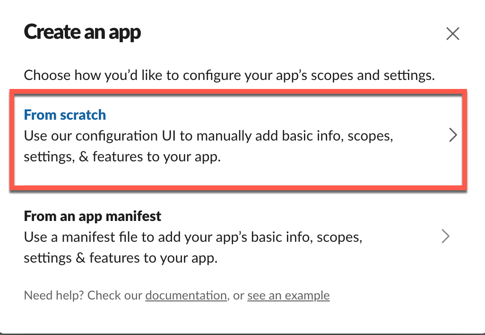

## Prerequisites

For your AnyIdentity propagation script to communicate with a Slack workspace, you must first create a Slack app. A Slack app is a way that Slack controls authentication and programmatic access to your workspace.

TO create a Slack app, navigate to the [Slack API page](https://api.slack.com/apps?new_app=1) and click "Create an App".

In the "Create an App" page, click on **From scratch**.

Next, pick a descriptive **App Name**, pick the workspace you'd like to receive notifications in and click on **Create App**.

PowerShell needs to communicate with Slack and the way to do with that Slack is via an incoming webhook. Click on the **Incoming Webhooks** section and then toggle on **Activate Incoming Webhooks**.

Next, click on **Add New Webhook to Workspace**.

And select a channel or user to send the AnyIdentity propagation notifications to. This will create the webhook URL.

Click on the **Copy** button to copy the webhook URL to the clipboard. You'll need this in your Slack propagation script.

Next, find **OAuth & Permissions** on the left side of the Slack app page and click on **Add an OAuth Scope**.

Add the **chat:write** and **chat:write.public** scopes to the app. Your **Bot Token Scopes** should now look like below:

Next, click on **reinstall your app** when the notification comes up on the top of the page providing the same information you did when setting up webhooks.

Finally, click on **Copy** to copy the **Bot User OAuth Access Token** to the clipboard. You'll need this in your Slack propagation script.

You're done with the one-time setup! Be sure to have the webhook URL and the bot user OAuth access token handy for your Slack propagation script.